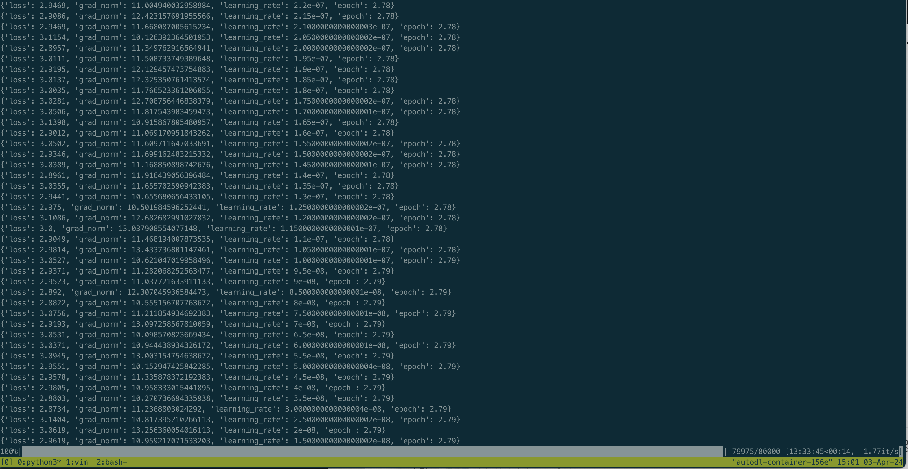
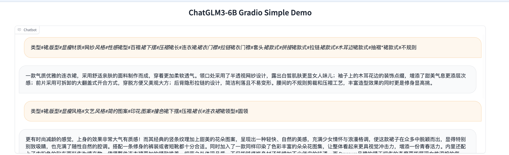
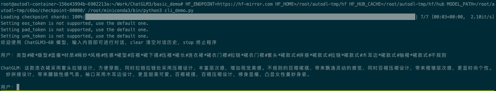

## 调整Lora微调参数

以[AdvertiseGen](https://huggingface.co/datasets/shibing624/AdvertiseGen)作为例子

在configs/lora.yaml中，将r调高到16,lora_alpha调高到32,max_steps大幅增加到80000

在一张4090的情况下，训练大概13小时。loss降为3.0左右。如图所示：

## Demo读入微调代码

根据比对，basic_demo/web_demo_gradio.py中，已经写好根据微调后的adapter_config.json的内容进行配置。使用时，仅需要传入MODEL_PATH参数，对微调后的模型进行指定。

gradio的效果如图所示：

与此同时，对cli_demo.py代码进行修改,让其可以读取微调后的代码，效果如图所示：

